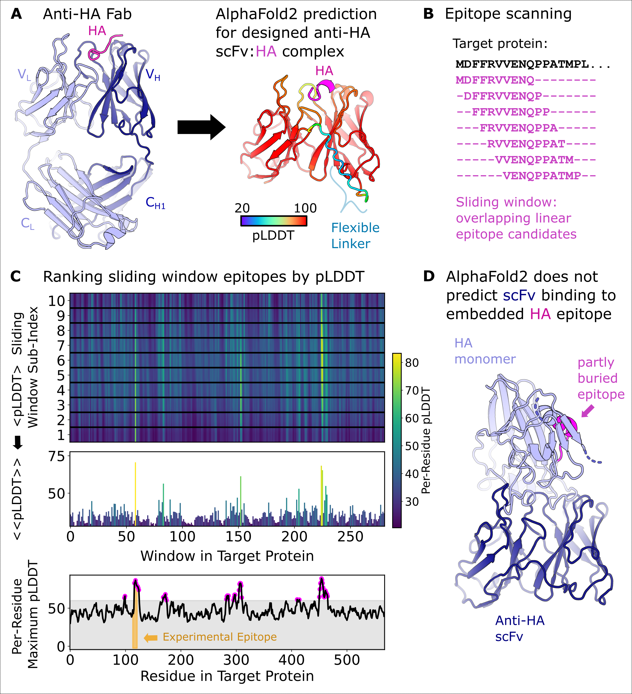

PAbFold (Peptide-AntiBody AlphaFold2) is a pipeline centered around AlphaFold2 for predicting both how well an antigen:antibody pair might interact with one another, an where the epitope subsequence is in the antigen. I welcome you to read our paper:  https://biorxiv.org/cgi/content/short/2024.04.19.590298v1

Requirements: 
- Linux
- Python 3.9
  - numpy
- AlphaFold2 (with local colabfold recommended, https://github.com/YoshitakaMo/localcolabfold)
- Our localcolabfold patch (allows pickling of MSAs/template .cif's for local use, to both prevent requeuing of the MSA server that the folks at MMseqs (https://github.com/soedinglab/MMseqs2) so graciously have provided for general use, and speeds up inference time (we can use the same MSA/template over and over again without negatively impacting performance. See publication).

An antibody sequence should first be converted to a single chain variable fragment (scFv) to drastically reduce the computational requirements (therefore time) needed (__Fig A__). For assistance on this, please see the scFv-ification repo (coming soon!). The script `A_PeptideMaping_prep_submission_files.py` creates a fasta file of several sequences, where we chop up the antigen sequence (__Fig B__) into several subsequences such that we can test every individual epitope of a specificied length (Figure example: 10) and sliding window (Figure example: 1). Afterwards every sequence is then paired with the scFv sequence in a fasta file for folding. Here is a toy example of the output fasta file, that has the chopped up antigen sequence paired to the scFv sequence:

```
>batch_1_peptide_1
scFv_sequence:ABCDEFGHIJ

>batch_1_peptide_2
scFv_sequence:CDEFGHIJKL

>batch_1_peptide_3
scFv_sequence:EFGHIJKLMN
```

